#  Forno Fácil

App mobile para controle de forno elétrico via NFC, com foco em acessibilidade para o público idoso.

>  **Sobre este repositório:** este é um repositório de apresentação (showcase). O código-fonte do projeto é mantido privado, pois o Forno Fácil é um produto com modelo de negócio comercial (B2B, comercializado em conjunto com o equipamento físico). Aqui você encontra a documentação técnica, a arquitetura e a demonstração do projeto.

## Sobre o projeto

O Forno Fácil nasceu para resolver um problema real: a dificuldade que pessoas idosas costumam ter com a tecnologia do dia a dia — nesse caso, controlar um forno elétrico. A solução une um aplicativo mobile simplificado a um forno equipado com NFC, permitindo operar o equipamento com um único toque, sem menus complexos.

## Funcionalidades

- Controle do forno via aproximação NFC, com interface simplificada e acessível
- Firmware ESP32 (Wi-Fi, MQTT, NFC e relé) desenvolvido para o controle físico do equipamento
- Feedback sonoro guiando o usuário em cada etapa (expo-av)
- Animações de orientação durante o uso (Animated API)
- Projeto de hardware documentado: diagramas de fiação e lista de componentes

## Arquitetura

| Camada | Tecnologias |
|---|---|
| Mobile | React Native, Expo, TypeScript |
| Embarcado | ESP32, Wi-Fi, MQTT, NFC, relé |
| Feedback | expo-av, Animated API (React Native) |

> Nota técnica: o fluxo completo do app (onboarding, receitas, preparo, alertas) está implementado, com simulação de leitura NFC e de temperatura no código. O firmware ESP32 já foi desenvolvido; a montagem do protótipo físico e os testes em hardware real são a próxima etapa do projeto.

## Captura de vídeo em formato GIF (sem efeitos sonoros)

## Capturas de tela

Fluxo completo do app: configuração inicial (feita uma única vez pelo familiar) seguida do uso no dia a dia.

| | | |
|---|---|---|
| 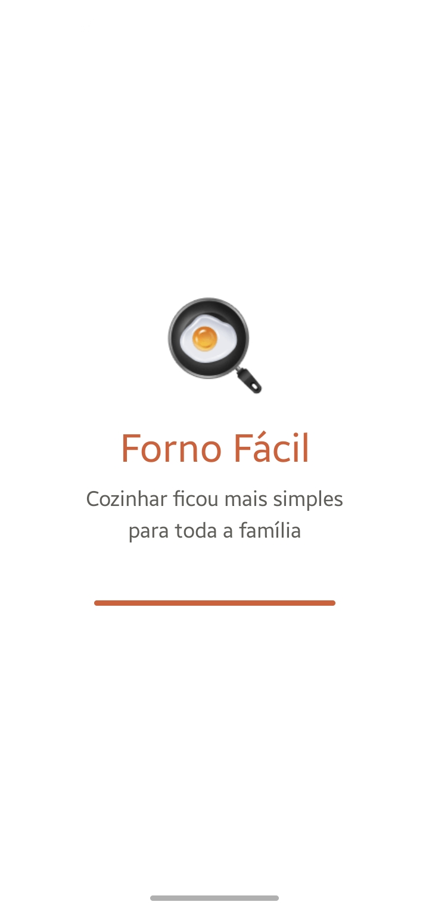 | 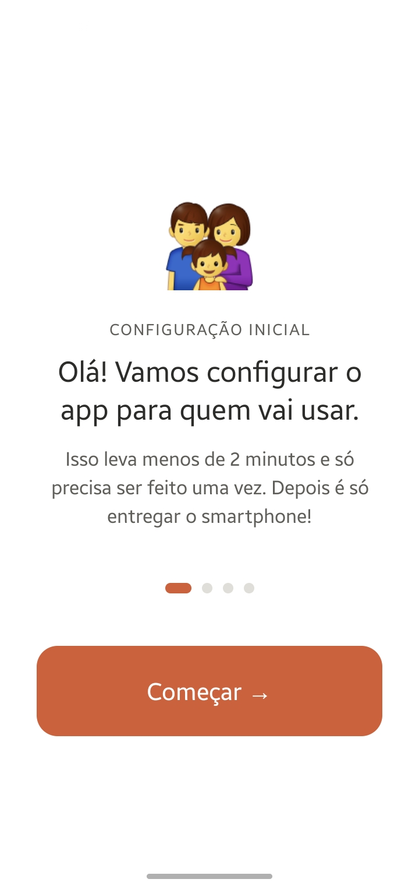 | 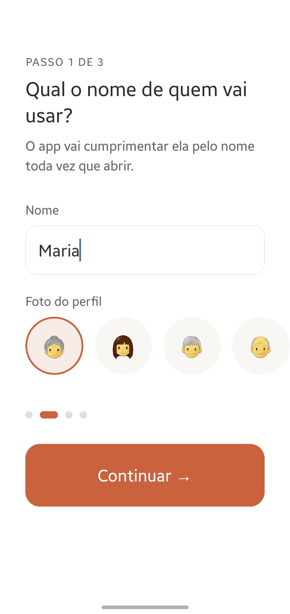 |
| Abertura do app | Início da configuração | Passo 1 — nome de quem vai usar |
| 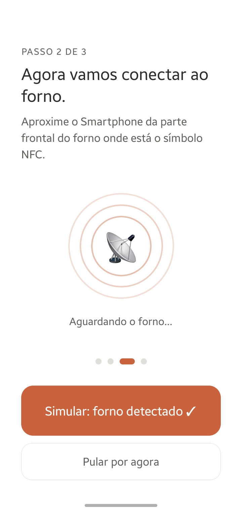 | 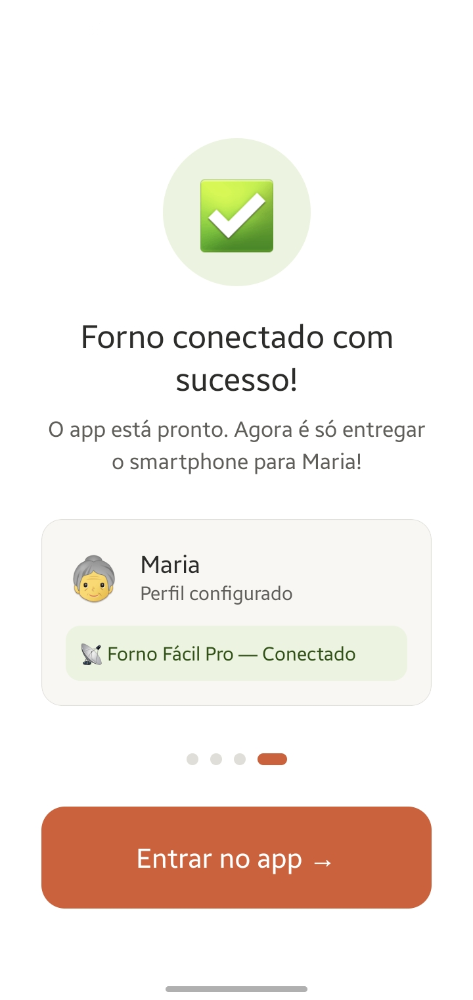 | 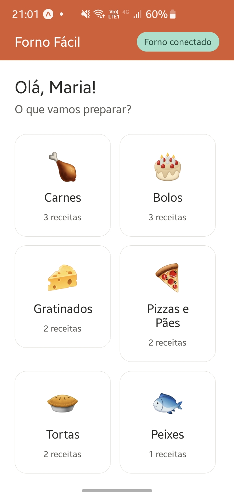 |
| Passo 2 — conexão com o forno | Passo 3 — configuração concluída | Tela inicial personalizada |
| 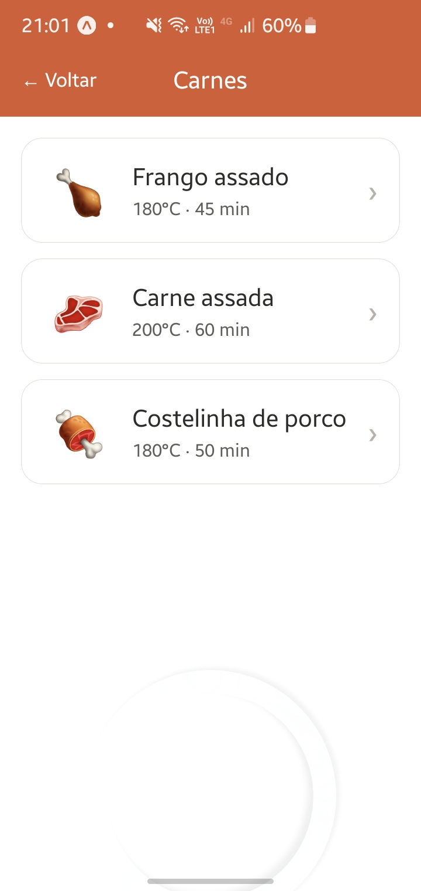 | 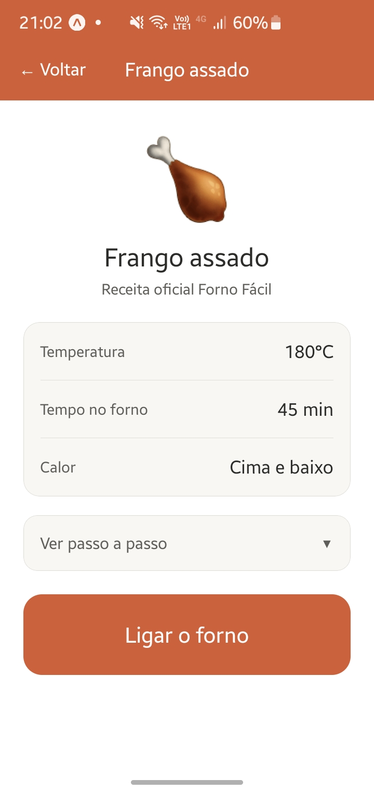 | 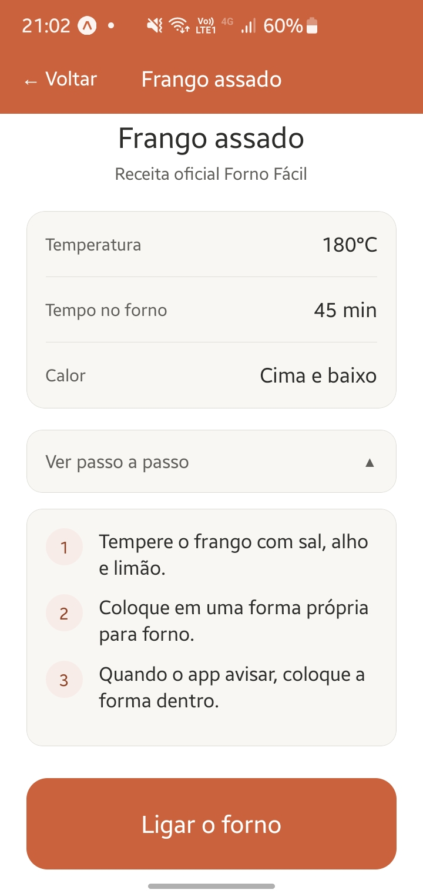 |
| Lista de receitas por categoria | Detalhe da receita | Passo a passo da receita |
| 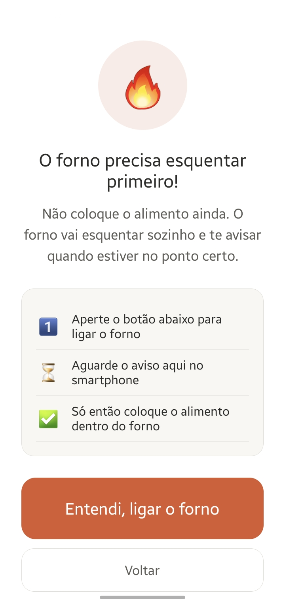 | 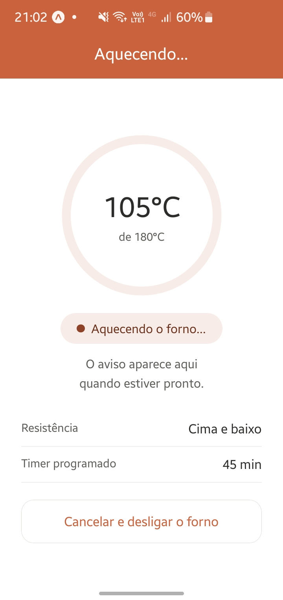 | 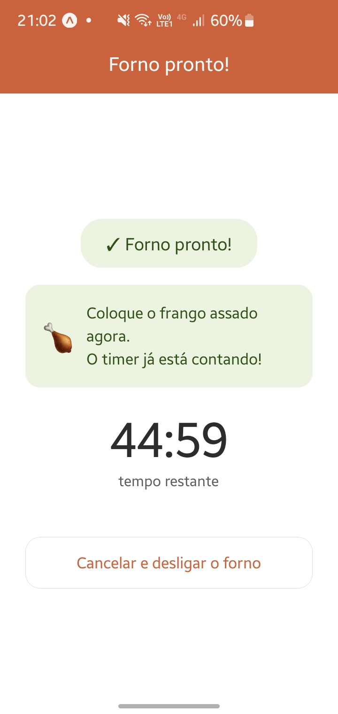 |
| Aviso de pré-aquecimento | Forno aquecendo, com progresso | Forno pronto, timer iniciado |

## Status do projeto

Em desenvolvimento ativo desde jan/2025.

## Autor

**Luiz Fernando Grimello**
Desenvolvedor Mobile & Full Stack
[GitHub](https://github.com/fernandogrimello) · [LinkedIn](https://www.linkedin.com/in/luiz-fernando-grimello-6568b4358) · fernandogrimello@gmail.com
